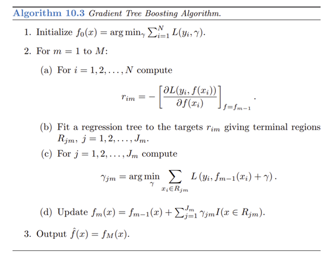

#### SUMMARY
In this project, we are going to implement parallel versions of Gradient Boosting Decision Tree (GBDT) algorithm. First, we will write a serial version of GBDT and then build the CPU parallel versions via Open MP and MPI, respectively. If there are GPU resources available, we also plan to implement GPU parallel version. Performance will be compared with sequential and parallel implementation of standard libraries such as XGBoost and LightGBM.

***
#### BACKGROUND
In recent years, Gradient Boosting Decision Tree has been widely used in many applications in industry such as advertising and recommendation system. As a boosting method, GBDT ensembles weak classifiers and improves the accuracy. In each iteration, it would build a new tree to reduce the residual caused by previous trees. The algorithm in pseudo code is shown as below (_<https://www.stat.auckland.ac.nz/~yee/784/files/ch10BoostingAdditiveTrees.pdf>_). 

To solve the bottleneck of GBDT, the training cost for many deep trees on large datasets, many researchers proposed various ways to parallel and distributed versions to accelerate the training process. For example, LightGBM uses fork-join paradigm to have work nodes train different decision trees. Among these implementations, XGBoost stands out and has been widely used in many applications.

We know there has been powerful and well-researched parallel implementations and we are not likely to propose new and better ones. Therefore, what we aimed in this project is to further familiarize ourselves with the parallelism skills learnt in the course and use them in practical projects. After implementation and detailed experiment and comparison, we believe we would have a more complete understanding of parallelism of algorithms on different platforms. 

***
#### CHALLENGE
1.	Get familiar with the GBDT algorithms. We have learnt GBDT before but never really implemented it. There must be many details that wait for us to figure out during the developing process.

2.	The biggest challenges lie in how to parallel the GBDT algorithms and the implementation. More specifically, for how to parallel, we have:
*	Node level parallelism;
*	Feature level parallelism; and
*	Value level parallelism

3.	For the implementation challenges, we have to consider the followings:
*	Minimizing the communication cost among the nodes;
*	Making efficient use of all available nodes; and
*	Adapting to different problems (with different properties)

***
#### RESOURCES
We will reference the implementation of sequential GBDT from the following open sources:

* <https://github.com/qiyiping/gbdt>
* <https://github.com/yarny/gbdt>

For Open MP and MPI version, we will implement our own solutions.

For CUDA versions, we will try our own implementations but may reference to:
* Mitchell R, Frank E. 2017. Accelerating the XGBoost algorithm using GPU computing. PeerJ Computer Science 3:e127 https://doi.org/10.7717/peerj-cs.127

***
#### GOALS AND DELIVERABLES

**Goals**
1.	A sequential version of Gradient Boosting Decision Tree.
2.	A parallel version of Gradient Boosting Decision Tree by Open MP.
3.	A parallel version of Gradient Boosting Decision Tree by MPI.
4.	Experiments and detailed analysis on GBDT of different versions in following dimensions: accuracy, number of tasks, speedup, and workload balance.

**Stretch Goals**
1.	A parallel version of Gradient Boosting Decision Tree by CUDA. 
2.	Performance comparison between high-dimensional sparse dataset and low-dimensional dense dataset.
3.	Improve the efficiency of CPU versions GBDT and get close results to XGBoost.

**Deliverables**
1.	Performance tables collected in different versions and different number of nodes used.
2.	Graphics that show the above performance tables. 
3.	Graphics that show the accuracy/speedup comparison between our implementation and XGBoost.
4.	Answers to following questions:
*	Did we achieve linear speedup? If not, what are the possible reasons?
*	Did we observe any workload imbalance in the CPU versions? Is there a way to improve it?
*	Compare the results of Open MP and MPI versions. Which one is better for GBDT? Why?

***
#### PLATFORM CHOICE:

For CPU versions, we are going to use Open MP and Open MPI in C++ to implement the Gradient Boosting Decision Tree. We have gained some experience using them through course assignments. 

For GPU versions, we are going to use CUDA. 

We will develop and debug the code on GHC machine and then collect the performance results on PSC machine which have more processors.

***
#### SCHEDULE:

| Date | Task |
|:----:|:----:|
|11/14 | Finish the sequential version |
|11/20 | Finish the open MP version |
|11/26 | Finish the MPI version |
|12/5  | Finish the experiments and analysis |
|12/8  | Finish the poster |
